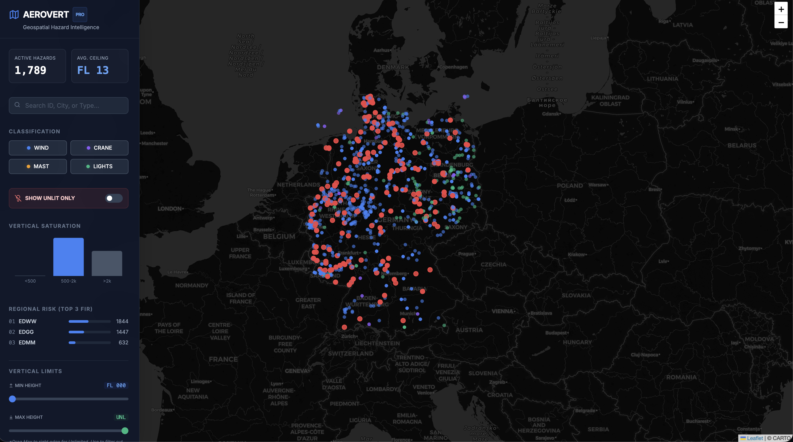
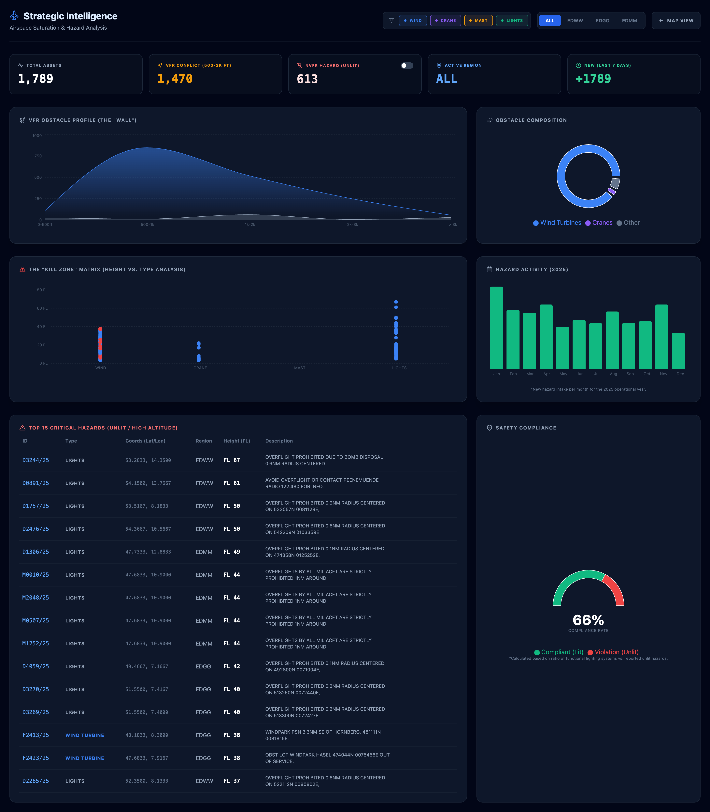

# Aerovert-DE

**Geospatial Hazard Intelligence for VFR Aviation in Germany**

🚀 **Live Demo:** [https://aerovert-de.vercel.app/](https://aerovert-de.vercel.app/)



## Executive Summary

**Aerovert-DE** is a geospatial intelligence platform designed to analyze and visualize **vertical obstacle risk** in German airspace using archived NOTAM data from 2025.

The platform focuses on obstacles that directly impact **VFR aviation safety**, including wind turbines, construction cranes, masts, and obstruction lighting. By transforming unstructured aviation notices into structured geospatial intelligence, Aerovert-DE enables both **operational awareness** and **strategic analysis** of airspace saturation.

This project is intentionally built as a **production-grade demonstration system**, reflecting how such a platform would be engineered in a professional aviation, infrastructure, or geospatial analytics environment.

---

## The Problem

Germany’s rapid expansion of renewable energy infrastructure has introduced thousands of new vertical structures into low-altitude airspace.

Key challenges include:

* Wind turbines exceeding 200 meters in height
* Temporary construction cranes appearing with high frequency
* NOTAM data published primarily as unstructured free text
* Limited tools for visualizing obstacle density and vertical congestion
* Increased night-flight risk from unlit obstacles (NVFR hazards)

The central question this project addresses is:

**Where and how is vertical obstacle saturation creating elevated risk for VFR operations in German airspace?**

---

## What the Platform Delivers

Aerovert-DE provides three tightly integrated capabilities:

1. **Operational Hazard Mapping**
2. **Vertical Risk & Saturation Analytics**
3. **Strategic Airspace Intelligence**

These are not mockups — the screenshots represent a fully functioning system.

---

## Operational Hazard Map

The core interface is an interactive map of Germany displaying thousands of classified obstacles derived from archived NOTAMs.


### Map Capabilities

* High-density geospatial rendering with clustering
* Aviation-optimized dark basemap for low-contrast environments
* Real-time filtering by:
  * Obstacle type (wind, crane, mast, lights)
  * FIR (EDWW, EDGG, EDMM)
  * Vertical limits (Flight Level ranges)
  * NVFR-only hazards (unlit obstacles)

Each map marker opens a **structured hazard card**, showing:

* FIR and NOTAM reference ID
* Obstacle classification
* Maximum vertical extent expressed in **Flight Levels (FL)**
* Horizontal influence radius (NM)
* Active date range
* Original NOTAM text for traceability

This preserves a verifiable link between raw aviation data and derived intelligence.

---

## Vertical Risk & Saturation Analysis

Beyond simple visualization, Aerovert-DE models **vertical airspace congestion**, a critical factor for VFR safety.

The platform enables:

* Identification of **VFR conflict bands** (e.g., 500–2000 ft)
* Visualization of vertical obstacle concentration (“the wall” effect)
* Differentiation between compliant obstacles and NVFR hazards
* Analysis of height distributions by obstacle type

This vertical perspective transforms flat obstacle data into **risk-aware intelligence**.

---

## Strategic Intelligence Dashboard

The analytics dashboard provides decision-oriented metrics rather than cosmetic charts.



Key outputs include:

* Total active obstacles
* NVFR hazard count (unlit structures)
* Regional risk comparison by FIR
* Monthly construction and hazard activity trends
* Obstacle composition breakdown
* Ranked list of critical hazards combining:
  * Height
  * Region
  * Obstacle type
  * Original NOTAM context

This supports both **operational scanning** and **strategic airspace analysis**.

---

## Insights Enabled by the Platform

Using the processed 2025 dataset, Aerovert-DE makes the following analyses possible:

* Northern Germany (EDWW) exhibits significantly higher obstacle density than southern regions
* Wind farm construction contributes to persistent vertical congestion in VFR-relevant flight levels
* Unlit obstacles represent a disproportionate night-flight risk
* Construction activity follows clear seasonal patterns
* Some obstacles remain active longer than initially published, creating extended exposure windows

These insights are driven by **data engineering and domain logic**, not by visualization alone.

---

## Architecture Overview

Aerovert-DE follows a clean, production-oriented monorepo architecture:

```
┌────────────────────┐
│  Next.js Web App   │  → Operational map & analytics UI
└─────────┬──────────┘
          │ REST API
┌─────────▼──────────┐
│   FastAPI Backend  │  → Parsing, analytics, geospatial queries
└─────────┬──────────┘
          │ SQL / GIS
┌─────────▼──────────┐
│ PostgreSQL + GIS   │  → Persistent spatial intelligence
└────────────────────┘
```

This separation ensures:

* UI remains fast and stateless
* Domain logic is centralized server-side
* Geospatial correctness is enforced at the database level

---

## Technology Stack

### Frontend (`apps/web`)

* Next.js 14 (App Router)
* TypeScript (strict mode)
* Tailwind CSS
* Leaflet & React-Leaflet
* Recharts
* SWR
* date-fns
* Lucide React

Designed for high-density geospatial rendering and analytical dashboards.

---

### Backend (`apps/api`)

* Python 3.12+
* FastAPI
* Uvicorn (ASGI)
* SQLAlchemy 2.0 (async)
* Alembic migrations
* GeoAlchemy2 (PostGIS)
* Pandas (ETL)
* openpyxl / xlrd (Excel ingestion)

Responsibilities include ingestion, parsing, classification, risk derivation, and analytics.

---

### Database

* PostgreSQL 16
* PostGIS 3.4

Used for geometry storage, spatial indexing, proximity queries, and vertical-risk aggregation.

---

## Project Structure

```
aerovert-de/
├── apps/
│   ├── api/
│   │   ├── app/
│   │   │   ├── db/
│   │   │   ├── main.py
│   │   │   └── config.py
│   │   ├── migrations/
│   │   ├── pyproject.toml
│   │   └── Dockerfile
│   └── web/
│       ├── src/
│       │   ├── app/
│       │   ├── components/
│       │   └── context/
│       ├── public/
│       └── Dockerfile
├── data/
│   ├── raw/
│   ├── staging/
│   └── curated/
├── docker-compose.yml
├── Makefile
└── README.md
```

---

## Data Pipeline

1. **Raw Input**
   Monthly archived NOTAM Excel files for 2025, organized by FIR.

2. **Ingest & Filter**
   Non-physical or irrelevant notices are discarded.

3. **Parse & Normalize**
   * Coordinate extraction
   * Height normalization to Flight Levels
   * Obstacle type classification
   * NVFR hazard detection

4. **Persist & Index**
   Cleaned records stored with spatial and temporal indexes.

5. **Analyze & Visualize**
   Served via API to the operational map and analytics dashboard.

---

## Local Development

### Prerequisites

* Docker
* Docker Compose
* Make

### Services & Ports

* Web UI: [http://localhost:3000](http://localhost:3000)
* API: [http://localhost:8000](http://localhost:8000)
  * Swagger UI: [http://localhost:8000/docs](http://localhost:8000/docs)
* Database: localhost:5432

### Common Commands

```bash
make install
make up
make down
make logs
```

The full stack can be started locally with a single command.

---

## Safety & Scope Disclaimer

This platform is a **demonstration and research system only**.
* Uses archived 2025 NOTAM data
* Does not provide real-time information
* Must not be used for flight planning or navigation
* Always consult official AIS and aviation authorities

This disclaimer is intentionally visible in both documentation and UI.

---

## Why This Project Matters

Aerovert-DE demonstrates:

* Real-world unstructured data engineering
* Geospatial analytics with PostGIS
* Vertical (altitude-based) risk modeling
* Domain-aware UX for aviation safety
* Clean full-stack architecture
* Production-oriented tooling and workflows

It reflects how a **geospatial safety intelligence platform** would be built in a professional setting.

---

## Future Extensions

* FIR and controlled airspace overlays
* Multi-year historical comparison
* Confidence scoring and review queues
* Exportable safety reports
* Role-based access for operational users

---